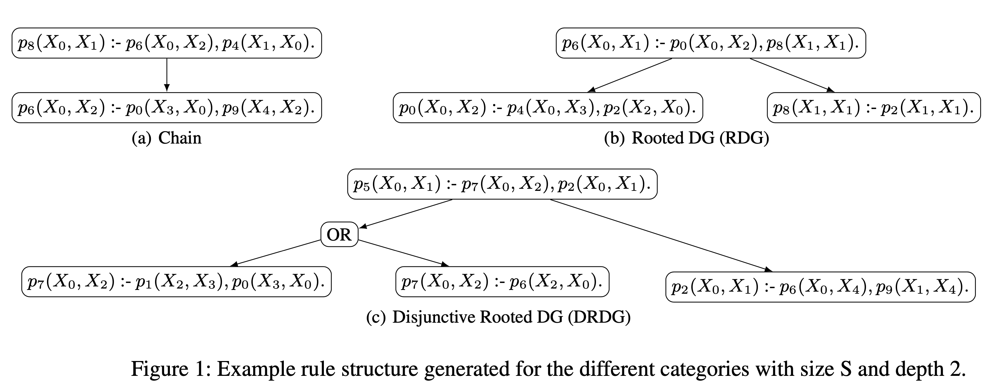

# RuDaS: Synthetic dataset generation code and evaluation tools for ILP

RuDaS (**S**ynthetic **Da**tasets for **Ru**le Learning), is a tool for generating synthetic datasets containing both facts and rules, and for evaluating rule learning systems, that overcomes the above mentioned shortcomings of existing datasets and proper evaluation methods. 

RuDaS is highly parameterizable; for instance, number of constants, predicates, facts, consequences of rules (i.e., completeness) amount of noise (e.g., wrong or missing facts) and kinds of dependencies between rules can be selected. 

Moreover, RuDaS allows for assessing the performance of rule learning systems by computing classical and more recent metrics, including a new one that we introduce.

In this repository there is also the code (see experiments/README) we used to evaluate representatives of different types of rule learning systems on our datasets demonstrating the necessity of having a diversified portfolio of datasets to help revealing the variety in the capabilities of the systems and thus also to support and help researchers in developing and optimizing new/existing approaches. 

### Example of data:
**Rules.**
```
p3(X0,X1) :- p7(X1,X0).
p7(X0,X2) :- p6(X0,X1), p6(X1,X2).
p7(X1,X0) :- p9(X3,X1), p9(X1,X0).
```
**Facts.**
```
p9(c127,c381).
p6(c324,c291).
p3(c363,c354).
p7(c61,c96).
...
```

### Paper:

[arXiv preprint](https://arxiv.org/abs/1909.07095)

### How to cite:

```latex
@misc{cornelio_thost_rudas,
    title={RuDaS: Synthetic Datasets for Rule Learning and Evaluation Tools},
    author={Cristina Cornelio and Veronika Thost},
    year={2019},
    eprint={1909.07095},
    archivePrefix={arXiv},
    primaryClass={cs.AI}
}
```
---
### Requirements: 
* Python 3 
<!--TODO any others check. then create file requirements.txt)-->
###  Experiments:

See experiments/README for additional requirements for running the experiments


## Available Datasets Description

<!--add <sub> and </sub> to reduce the font-->

  
| \#  | type | Size | Depth |\#Rules|\#Rules|\#Rules|\#Facts|\#Facts|\#Facts|\#Pred|\#Pred|\#Pred|\#Const|\#Const|\#Const|
|--- | ---  | ---  | ---   | --- | ---   | --- | --- | ---   | --- | --- | ---  | --- | ---| ---   | --- |
|     |      |      |       | min |   avg |max  | min | avg   |max  | min | avg  |max  | min| avg   |max  |
| 10  |CHAIN |   XS | 2     |2    |2      |2    | 51  |74     |95   | 5   |7     |9    | 31 |47     |71   |
| 10  |CHAIN |   XS | 3     |3    |3      |3    | 49  |70     |97   | 7   |8     |  9  | 31 |43     |64   |
| 10  |CHAIN | S | 2  | 2|2|2 | 168|447|908 | 9|10|11 | 97|259|460|
|      10 |CHAIN  | S |  3 | 3|3|3 | 120|508|958 |8|10|11 | 52|230|374|
|    22 | RDG  |  XS | 2  | 3|3|3 | 49|84|122 | 6|9|11 | 28|50|84 | 
|     12 | RDG  |  XS | 3  | 4|5|6 | 56|104|172 | 8|10|11 | 41|55|75 |
|     22 |  RDG  | S | 2 | 3|3|3 | 200|646|1065 | 6|11|11 | 71|370|648   |
|     22 |RDG  |  S | 3 | 4|5|7 | 280|613|1107 | 10|11|11 | 149|297|612   |
|    22 |DRDG |  XS | 2  | 3|4|5 | 60|100|181 | 6|9|11 | 29|55|82    |
|   12 |DRDG |  XS |3  | 4|7|11 | 58|144|573 | 8|10|11 | 34|58|89   |
|    22 |DRDG |  S |2 | 3|4|5 | 149|564|1027 | 10|11|11 | 88|327|621   |
|    22 |DRDG |  S |3 | 4|7|12 | 111|540|1126 | 10|11|11 | 70|284|680   |


## Dataset generation code

* rules can be arbitrary long and with n-ary predicates
* anonimous constants and predicates = constants c1 c2 .. , predicates p1 p2 ..
* format: prolog standard, 2 different files type: one for facts one for rules
* parameters:
   * number of constants
   * number of predicates
   * min/max arity of predicates
   * number ofrules
   * maximal length of rules
   * number of reasoning steps (depht of the tree or number of total steps)
   * connected components rules category
   * min/max number of connected components
   * maximal depth of rule graphs 
   * dataset size: XS, S, M, L, XL
   * open-world degree n_OW in [0, 1]
   * amount of noise in the data nNoise+ , nNoise- in [0, 1]
* Noise:
   * adding fact that are not necessary to prove the goal: nNoise+
   * removing support facts: nNoise-
   * removing consequences facts: n_OW
* categories to show capabilities of the ILP system:
   * *Chain* -> h:-b1,b2. b1:-a1,a2. a1:-c1,c2
   * *Rooted Directed Graph* (DG) -> h:-b1,b2. b1:-a1,a2. b2:-c1,c2. a1:-d1,d2. a2:-d3,d4. ...
   * *Disjunctive Rooted DG* -> different rules same head: h:-b1,b2. h:-a1,a2. h:-c1,c2.
   * *Mixed* -> mix of the above.
   * All of them can have recursion -> h(X):-h(Y),b1(X,Y). b1(X,Y):-b1(Z,Y),b2(X,Z)



## Evaluation Tools for ILP systems

Evaluation tool to compute distances between logic programs:
* *Herbrand distance:* the traditional distance between Herbrand models; two normalized versions of the Herbrand distance
* *Herbrand accuracy:* (H-accuracy), Herbrand distance normalized on the Herbrand universe
* *Herbrand score:* (H- score), a new metric we propose in this paper;
* *Accuracy*
* *Precision* (or standard confidence)
* *Recall*
* *F1-score*
* *Rule-score*: a computationally efficient measure that consider only the induced rules and not the grounded atoms.

Predicate invention is not penalized in the evaluation.


## Future extensions
* Probabilistic dataset: generate probabilistic facts and/or rules
* More expressive logic: for example full first order or higher order
<!--ADD MORE-->

